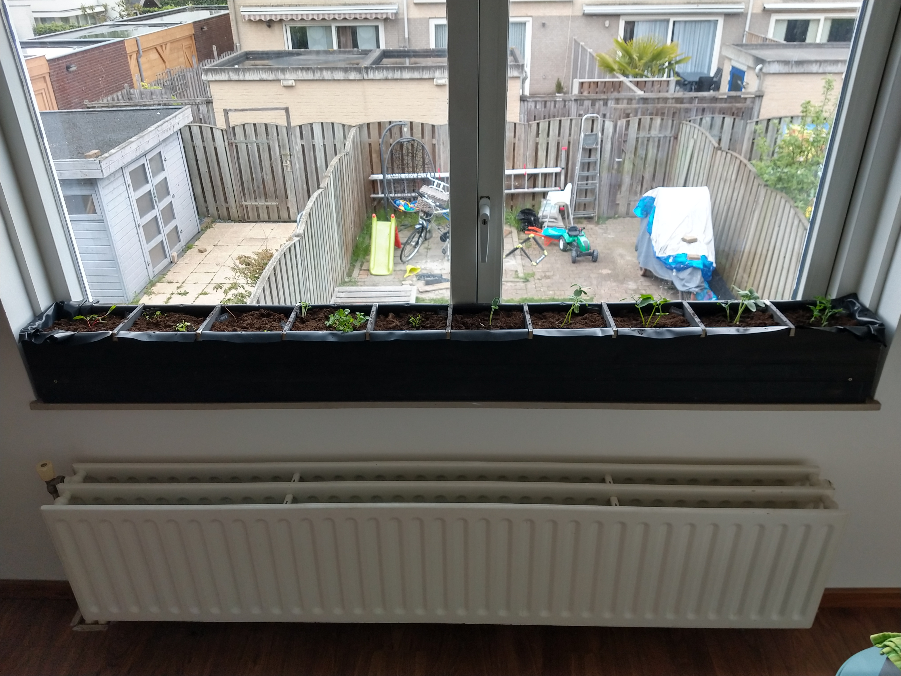

Our [MoestuinMaatjes](https://www.ah.nl/acties/moestuinmaatjes) from Albert Heijn were getting too big for their initial pots. Therefore I made a planter in which a bunch of them would fit.

A few notes on how it was made:
1. The sides are made from old planks with rabbets.
1. On the left and right side on the inside there are small hardwood beams to which the side planks are attached.
1. The bottom is made from a hardwood plank nailed in between the side planks.
1. The inside is coated with pond liner.
1. The partitions are slid into notches in the side planks and are removable.