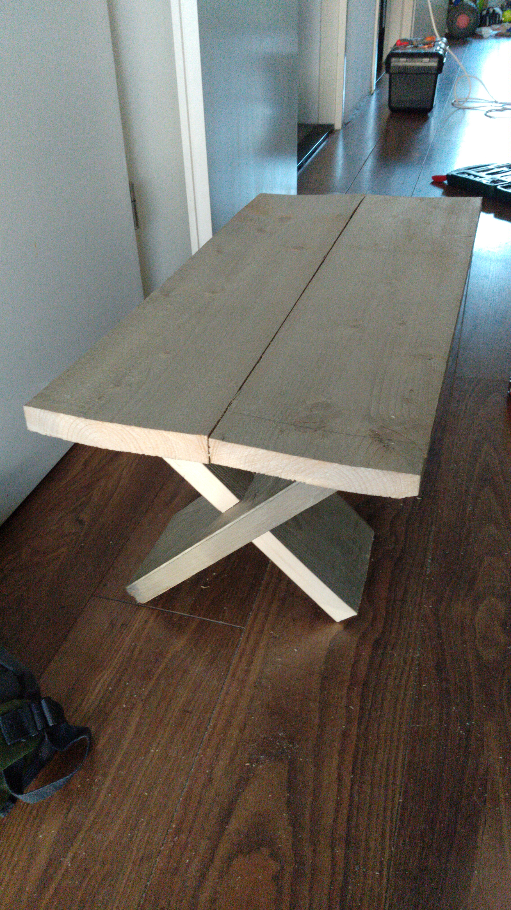

For our "Sinterklaas surprise" of 2020 I made a small table from scaffolding wood we had lying around. I only have this one picture of it.

A few notes on how it was made:
1. The table legs contain notches by which they have been partially slid into each other.
1. On the upper end the table legs have been cut diagonally. (Though this was done somewhat rough, based on eyesight instead of drawing it out first.)
1. In the middle, from both directions, there is a small plank attached to the underside of the table. This makes sure the top of the table doesn't collapse. (It's small and there is only one because the wood was spent.)